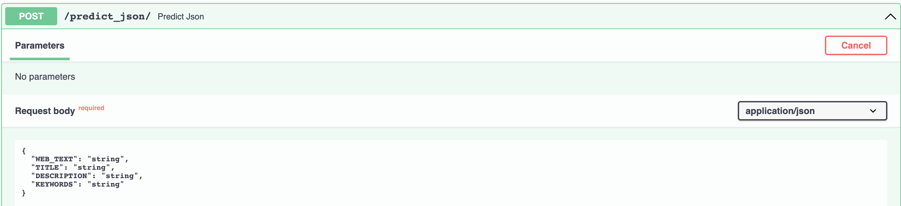
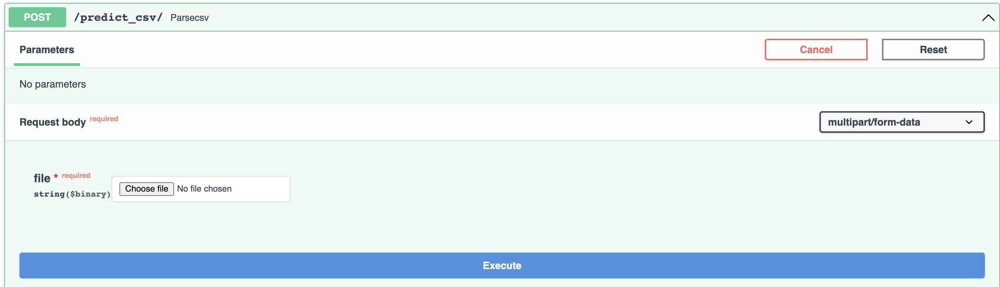

# text-classifier-test
Test Task
=============

Simple REST API service that predicts a type of place - restaurant or accommodation

How to Run
=============

```
bash run_app.sh
```

Basic Features
=============

* JSON prediction - takes a JSON input data and returns prediction (restaurant / accommodation)


* CSV prediction and basic metrics - takes CSV file as an input and returns a dictionary containing ROC AUC, accuracy and predicted labels for a given file. If no labels provided only predictions returned

